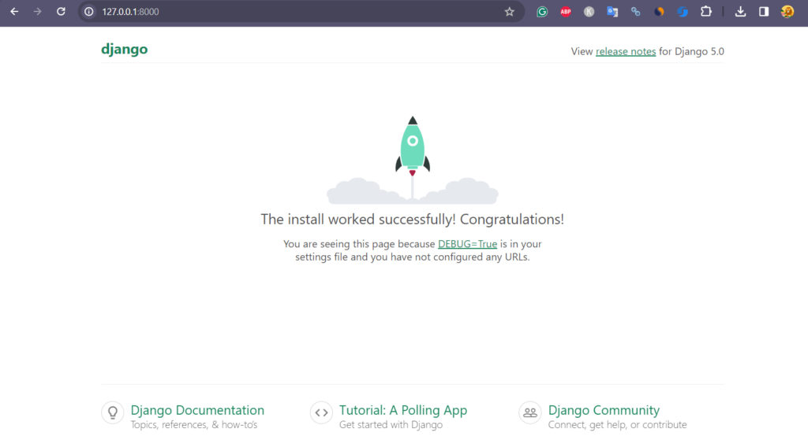

# Django - Create Virtual Environment
## How to Create a Python Virtual Environment on Linux

1. **Open your terminal.**

2. **Navigate to your project directory:**
   ```bash
   cd /path/to/your/project
   ```

3. **Create a virtual environment:**
   ```bash
   python3 -m venv myworld
   ```
   Replace `myworld` with your preferred environment name.

4. **Activate the virtual environment:**
   ```bash
   source myworld/bin/activate
   ```

5. **To deactivate the environment:**
   ```bash
   deactivate
   ```
## Install Django in Virtual Environment

After activating your virtual environment, install Django using one of the following commands:

```bash
(myworld) ... $ pip install django
```
Or

```bash
(myworld) ... $ python3 -m pip install django
```
## Create a Django App

To create a new app (for example, `members`), run:

```bash
(myworld) ... $ python3 manage.py startapp members
```

Django will create a folder named `members` in your project directory, with this structure:

```
my_tennis_club/
    manage.py
    my_tennis_club/
    members/
        migrations/
            __init__.py
        __init__.py
        admin.py
        apps.py
        models.py
        tests.py
        views.py
```
## clone app netfix
To clone the Netfix app repository, use the following command in your terminal:

```bash
git clone https://github.com/Margoumachraf/netfix.git
```

After cloning, navigate into the project directory:

```bash
cd netfix
```

## Set Up the Database (MySQL or SQLite) and Migrate

### For SQLite (default Django database)

1. No extra setup is needed. By default, Django uses SQLite.
2. Run migrations to create the database tables:
   ```bash
   python3 manage.py makemigrations
   python3 manage.py migrate
   ```

### For MySQL

1. **Install MySQL client for Python:**
   ```bash
   pip install mysqlclient
   ```
   Or:
   ```bash
   pip install pymysql
   ```

2. **Create a MySQL database:**
   ```bash
   mysql -u your_mysql_user -p
   ```
   Then in the MySQL shell:
   ```sql
   CREATE DATABASE your_db_name CHARACTER SET UTF8;
   EXIT;
   ```

3. **Configure Django to use MySQL**  
   Edit your `settings.py`:
   ```python
   DATABASES = {
       'default': {
           'ENGINE': 'django.db.backends.mysql',
           'NAME': 'your_db_name',
           'USER': 'your_mysql_user',
           'PASSWORD': 'your_mysql_password',
           'HOST': 'localhost',
           'PORT': '3306',
       }
   }
   ```

4. **Run migrations:**
   ```bash
   python3 manage.py makemigrations
   python3 manage.py migrate
   ```


## Run the Django Project

After setting up your database and applying migrations, you can start the Django development server with:

```bash
python3 manage.py runserver
```

Then open your browser and go to [http://127.0.0.1:8000/](http://127.0.0.1:8000/)


